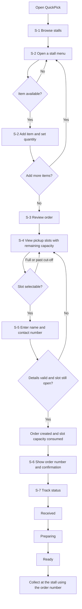
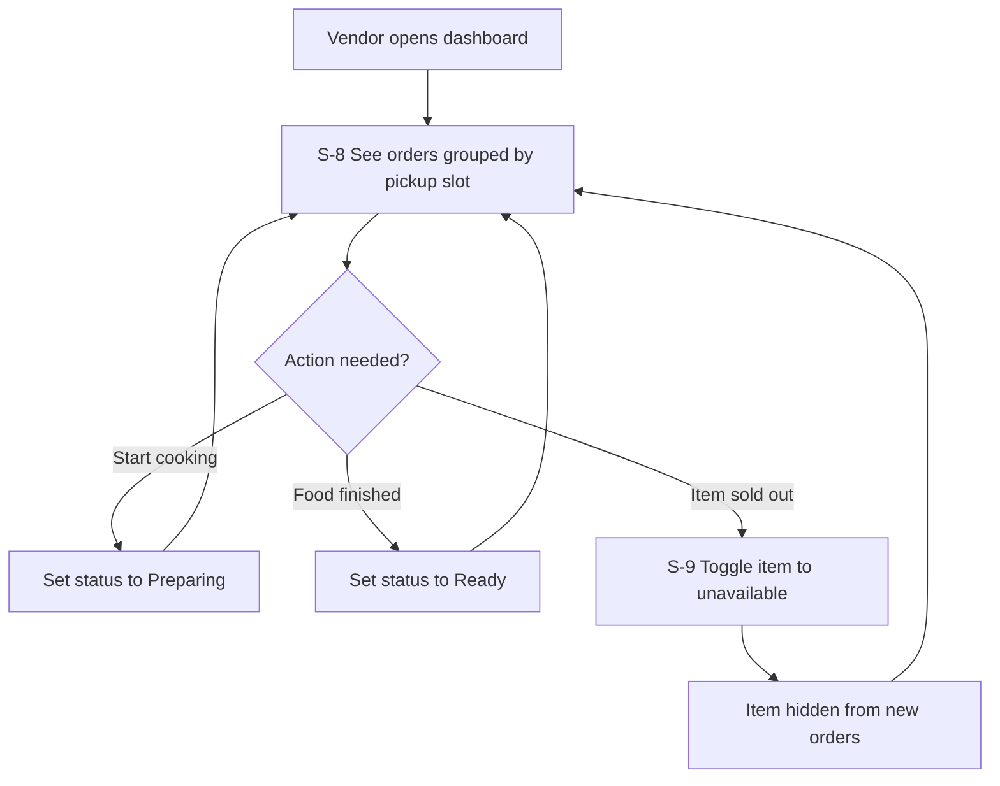

# CanteenFlow QuickPick — Design Thinking

| Field | Value |
| --- | --- |
| Project | CanteenFlow QuickPick |
| Student | Dilshan Gulati |
| Student ID | 6605142005 |
| Project owner | Dilshan Gulati (sole owner) |
| Work type | Individual assignment |
| Document | Design Thinking (Empathize, Define, Ideate, Prototype, Test) |
| Date | 2026-09-05 |

**Related documents:** [Documentation index](./README.md) ·
[Project Charter](./Project-Charter-CanteenFlow-QuickPick.md) ·
[Requirements](./Requirements-Specification-CanteenFlow-QuickPick.md) ·
[Acceptance Criteria](./Acceptance-Criteria-CanteenFlow-QuickPick.md) ·
[Database Design](./Database-Design-CanteenFlow-QuickPick.md)

---

## Contents

- [1. Origin of the individual idea](#1-origin-of-the-individual-idea)
- [2. Empathize](#2-empathize)
- [3. Define](#3-define)
- [4. Ideate](#4-ideate)
- [5. Prototype](#5-prototype)
- [6. Test](#6-test)
- [7. Next steps](#7-next-steps)

---

## 1. Origin of the individual idea

### 1.1 The shared class concept

The class works from a shared concept called **CanteenFlow**: bringing campus canteen ordering online so
students do not have to queue at a counter to order and pay. That shared concept is broad. It could grow in
many directions — delivery, payments, nutrition tracking, loyalty schemes, vendor analytics.

### 1.2 The individual interpretation

**CanteenFlow QuickPick** is my own individual interpretation of that starting point. It keeps only the idea
of ordering campus food ahead of time, and then commits to a single mechanism that the shared concept does
not specify:

> **Every pickup time slot has a limited capacity. When a slot fills, or when its cut-off passes, it can no
> longer be selected.**

The distinction matters, and it is the reason this is an original interpretation rather than a restatement:

| Aspect | Shared CanteenFlow concept | CanteenFlow QuickPick (this project) |
| --- | --- | --- |
| Framing question | How do we let students order canteen food online? | How do we stop the lunchtime queue forming at all? |
| Core mechanism | Digital ordering | Capacity-limited pickup slots |
| What the student picks | Food | Food **and a time** |
| Success measure | Orders placed through the site | Demand spread evenly across the lunch period |
| Vendor benefit | Fewer counter interactions | A predictable, level workload per slot |
| Effect on queue | Moves the queue online, but arrivals may still cluster | Caps how many people can arrive in the same few minutes |

### 1.3 Why the narrow focus

Ordering ahead alone does not remove a queue. If a hundred students all order ahead and all arrive at 12:05,
there is still a crowd at the counter — the queue has simply moved. **Capacity per slot is what actually
changes the shape of the demand.** By making the time slot a scarce, bookable resource with a visible
remaining count, the system encourages students to spread out, and gives the vendor a workload they can
physically meet.

Everything in this project is judged against that goal. Delivery, payments, loyalty points, AI
recommendations, and multi-campus support are excluded because none of them make the queue shorter, and each
would dilute the individual focus.

---

## 2. Empathize

### 2.1 Evidence status — read first

> ⚠️ **No interviews, surveys, observations, or usability tests have been carried out for this project.**
>
> Everything in this Empathize section is an **assumption written by the project owner** to guide design.
> Each item is explicitly labelled **HYPOTHESIS**. Any quotation shown is an *illustrative* sentence written
> by me to express an assumed feeling — it is **not** a real quotation from a real person, and it is not
> evidence.
>
> No statistics, percentages, counts, or research findings are claimed anywhere in this document. Each
> hypothesis is carried into the [validation backlog](#63-validation-backlog) so it can be tested before it
> is relied upon.

### 2.2 Who I am designing for

| Group | Description | In MVP? |
| --- | --- | --- |
| **Primary — students with short breaks** | Students with a gap of roughly 15–30 minutes between classes who want food without losing the whole break to a queue. | Yes |
| **Secondary — canteen stall vendors** | Small stall operators who prepare food to order and must handle demand concentrated in a short window. | Yes |
| Tertiary — canteen administration | Staff who care about crowding and hygiene in the seating area. | Not addressed in MVP |

### 2.3 Primary persona (HYPOTHESIS)

> **HYPOTHESIS.** This persona is constructed from my own assumptions about campus life. It has not been
> validated with any real student.

| Attribute | Detail |
| --- | --- |
| Name | "Nara" (fictional persona, not a real person) |
| Role | Second-year undergraduate student |
| Context | Classes in different buildings; a short gap between a morning and an afternoon class |
| Devices | Uses a phone on campus Wi-Fi; rarely opens a laptop between classes |
| Money | Pays with cash or a scan-to-pay app at the counter; does not want to enter card details in a student project site |
| Goal | Eat something and still arrive at the next class on time |
| Frustration (assumed) | Arriving at the counter at the busiest minute and not knowing whether the wait is two minutes or fifteen |
| Behaviour (assumed) | Will skip lunch entirely if the queue looks long, then buy snacks later |
| Success looks like | Walking up, giving an order number, and leaving with food within about a minute |

**Illustrative sentence expressing the assumed feeling — written by me, not a real quotation:**

> *"I do not mind waiting for the food to be cooked. I mind standing in a line not knowing if I will make it
> back in time."*

### 2.4 Secondary persona (HYPOTHESIS)

> **HYPOTHESIS.** Constructed assumption; not validated with any real vendor.

| Attribute | Detail |
| --- | --- |
| Name | "Stall owner at Stall B" (fictional persona) |
| Role | Operates a single campus food stall |
| Context | Cooks to order with one or two helpers; the rush is concentrated in a short window |
| Devices | One phone or a small tablet at the stall; hands are often busy |
| Goal | Sell as much as possible without food quality or the queue collapsing during the peak |
| Frustration (assumed) | Taking orders and cooking at the same time; running out of an item but still being asked for it |
| Success looks like | A short list of orders per time slot, and one tap to mark an order ready |

**Illustrative sentence expressing the assumed feeling — written by me, not a real quotation:**

> *"If I know how many orders are coming at 12:15, I can cook for 12:15."*

### 2.5 Empathy map — primary persona (HYPOTHESIS)

> **HYPOTHESIS.** Every cell below is an assumption to be tested, not an observation.

| Quadrant | Assumed content |
| --- | --- |
| **Says** | "Is the line long right now?" · "Just order for me, I will pay you back." · "I will grab something later." |
| **Thinks** | *Will I make it back before the lecture starts?* · *Is the dish I want still available?* · *If I leave the line now I lose my place.* |
| **Does** | Checks the canteen from the doorway and turns away if it looks busy · Sends a friend ahead to order · Eats snacks from a vending machine instead |
| **Feels** | Rushed · Uncertain about the wait · Reluctant to commit to a queue of unknown length |
| **Pains** | Unknown waiting time · Losing most of a short break to queueing · Discovering at the counter that an item has sold out |
| **Gains** | A guaranteed pickup moment · Knowing the food is already being prepared · Being able to plan the break around a fixed time |

### 2.6 Assumed current journey (HYPOTHESIS)

| Step | What happens today (assumed) | Assumed pain |
| --- | --- | --- |
| 1 | Class ends; the student walks to the canteen | Time already spent walking |
| 2 | Scans the stalls to judge queue lengths | No information until physically present |
| 3 | Joins a queue | Wait length unknown and unbounded |
| 4 | Orders at the counter | May learn only here that an item is sold out |
| 5 | Waits for preparation | Cannot use the waiting time for anything else |
| 6 | Collects food and leaves | Little of the break remains |

---

## 3. Define

### 3.1 Problem statement

> **Students with a short break between classes cannot tell in advance how long a canteen queue will take, so
> they either spend most of their break waiting or skip the meal. Vendors receive their entire demand in one
> unpredictable spike, which they cannot prepare for. There is no mechanism that spreads arrivals across the
> lunch period.**

### 3.2 Point of view statements

| # | Point of view |
| --- | --- |
| POV-1 | **Nara, a student with a 20-minute break, needs a way to reserve a specific pickup moment**, because standing in a queue of unknown length is the part of the meal she cannot budget for. |
| POV-2 | **A stall vendor needs demand divided into known, capped batches**, because cooking and order-taking compete for the same hands during the rush. |

### 3.3 How Might We questions

| # | How Might We | Taken forward? |
| --- | --- | --- |
| HMW-1 | How might we let a student know their exact pickup time *before* leaving class? | **Yes** — became the pickup slot |
| HMW-2 | How might we stop too many students arriving in the same minute? | **Yes** — became slot capacity |
| HMW-3 | How might we make sold-out items visible before the student walks over? | **Yes** — became item availability |
| HMW-4 | How might we let a student see that food is already being cooked? | **Yes** — became order status tracking |
| HMW-5 | How might we let a vendor update orders without stopping cooking? | **Yes** — became the one-tap vendor dashboard |
| HMW-6 | How might we remove the payment step from the queue? | No — payments are out of scope for this version |
| HMW-7 | How might we bring food to the student? | No — delivery is out of scope |

### 3.4 Design principles

1. **The slot is the product.** Capacity control is the feature; ordering is the delivery mechanism for it.
2. **Never offer something that cannot be honoured.** A full or expired slot, or an unavailable item, must not
   be selectable — not merely warned about.
3. **No account required.** A name and a contact number are enough; registration would cost more time than the
   queue does.
4. **One-handed vendor use.** Vendor actions must work as single taps on a phone while cooking.
5. **Honest state.** The student always sees the real remaining capacity and the real order status.

### 3.5 Scope of this individual MVP

| # | MVP feature | Requirement | Acceptance criterion |
| --- | --- | --- | --- |
| 1 | Browse campus food stalls | [FR-01–FR-03](./Requirements-Specification-CanteenFlow-QuickPick.md#41-stalls-and-menu-mvp-1-2-and-3) | [AC-01](./Acceptance-Criteria-CanteenFlow-QuickPick.md#3-ac-01--browse-campus-food-stalls) |
| 2 | View menu items, prices, images, availability | [FR-04–FR-06](./Requirements-Specification-CanteenFlow-QuickPick.md#41-stalls-and-menu-mvp-1-2-and-3) | [AC-02](./Acceptance-Criteria-CanteenFlow-QuickPick.md#4-ac-02--view-menu-items-prices-images-and-availability) |
| 3 | Select items and quantities | [FR-07–FR-08](./Requirements-Specification-CanteenFlow-QuickPick.md#41-stalls-and-menu-mvp-1-2-and-3) | [AC-03](./Acceptance-Criteria-CanteenFlow-QuickPick.md#5-ac-03--select-items-and-quantities) |
| 4 | View pickup slots with remaining capacity | [FR-09](./Requirements-Specification-CanteenFlow-QuickPick.md#42-pickup-slots-mvp-4-and-5) | [AC-04](./Acceptance-Criteria-CanteenFlow-QuickPick.md#6-ac-04--view-pickup-slots-with-remaining-capacity) |
| 5 | Prevent selection of full or expired slots | [FR-10–FR-12](./Requirements-Specification-CanteenFlow-QuickPick.md#42-pickup-slots-mvp-4-and-5) | [AC-05](./Acceptance-Criteria-CanteenFlow-QuickPick.md#7-ac-05--prevent-selection-of-full-or-expired-pickup-slots) |
| 6 | Submit an order with name and contact | [FR-13–FR-15](./Requirements-Specification-CanteenFlow-QuickPick.md#43-ordering-mvp-6-and-7) | [AC-06](./Acceptance-Criteria-CanteenFlow-QuickPick.md#8-ac-06--submit-an-order-using-a-customer-name-and-contact-information) |
| 7 | Receive an order number and confirmation | [FR-16–FR-17](./Requirements-Specification-CanteenFlow-QuickPick.md#43-ordering-mvp-6-and-7) | [AC-07](./Acceptance-Criteria-CanteenFlow-QuickPick.md#9-ac-07--receive-an-order-number-and-confirmation) |
| 8 | Track Received / Preparing / Ready | [FR-18–FR-20](./Requirements-Specification-CanteenFlow-QuickPick.md#44-order-tracking-mvp-8) | [AC-08](./Acceptance-Criteria-CanteenFlow-QuickPick.md#10-ac-08--track-status-as-received-preparing-or-ready) |
| 9 | Vendor dashboard | [FR-21–FR-26](./Requirements-Specification-CanteenFlow-QuickPick.md#45-vendor-dashboard-mvp-9) | [AC-09](./Acceptance-Criteria-CanteenFlow-QuickPick.md#11-ac-09--vendor-dashboard-for-orders-and-menu-availability) |

Out of scope for this version: delivery, online payments, loyalty points, AI recommendations, multi-campus
support, student accounts, and native mobile apps. See the
[Project Charter](./Project-Charter-CanteenFlow-QuickPick.md#4-scope) for the full boundary.

---

## 4. Ideate

### 4.1 Options considered for reducing the queue

| # | Idea | Effect on the queue | Decision |
| --- | --- | --- | --- |
| I-1 | Plain pre-ordering with no time control | Moves ordering online, but arrivals still cluster | Rejected — does not solve the problem |
| I-2 | Live "current queue length" display | Informative, but reactive; everyone reacts the same way at once | Rejected as the core mechanism |
| I-3 | **Fixed pickup slots with a hard capacity limit** | Caps arrivals per interval and levels vendor workload | **Selected — core mechanism** |
| I-4 | Estimated ready time calculated per order | Flexible, but hard to keep honest without kitchen telemetry | Deferred |
| I-5 | Queue ticket taken on arrival | Still requires the student to be present to hold a place | Rejected |
| I-6 | Pickup lockers | Requires hardware the project cannot deploy | Rejected |
| I-7 | Off-peak price incentives | Requires payments, which are out of scope | Rejected |
| I-8 | Per-item availability toggle for the vendor | Prevents wasted trips for sold-out food | **Selected — supporting feature** |
| I-9 | Order status tracking (Received / Preparing / Ready) | Lets a student stay away until the food is genuinely ready | **Selected — supporting feature** |
| I-10 | Account registration and profiles | Adds friction to a two-minute task | Rejected for this version |

### 4.2 Prioritisation

| Idea | Queue impact | Build cost | Verdict |
| --- | --- | --- | --- |
| I-3 Slot capacity | High | Medium | MVP core |
| I-8 Availability toggle | Medium | Low | MVP |
| I-9 Status tracking | Medium | Low | MVP |
| I-2 Live queue display | Low | Medium | Backlog |
| I-4 Estimated ready time | Medium | High | Backlog |
| I-7 Off-peak pricing | Medium | High | Out of scope |

### 4.3 The selected concept in one paragraph

Each stall publishes a series of pickup slots across its service period — for example, 15-minute intervals
from 11:00 to 14:00. Each slot carries a maximum number of orders the stall can hand over in that interval,
and an ordering cut-off. Students see each slot with its remaining capacity; full slots and slots past their
cut-off are shown but cannot be selected. Because the number of students who can arrive in any interval is
capped in advance, the physical queue is bounded by design rather than managed after it has formed.

---

## 5. Prototype

### 5.1 Prototype fidelity

The prototype for this stage is a **low-fidelity, click-through screen flow** — screen sketches and the
navigation between them. It is a wireframe-level artefact, not working software. No application code exists
yet.

### 5.2 Screen inventory

| # | Screen | Purpose | Key elements |
| --- | --- | --- | --- |
| S-1 | Stall list | Entry point | Stall name, image, open/closed state, short description |
| S-2 | Stall menu | Choose food | Item image, name, price, availability badge, quantity stepper |
| S-3 | Order review | Confirm the basket | Line items, quantities, line totals, order total, edit and remove |
| S-4 | Pickup slot picker | Choose a time | Slot time range, remaining capacity, disabled state for full or expired slots |
| S-5 | Customer details | Identify the order | Name field, contact number field, validation messages |
| S-6 | Confirmation | Hand over the order number | Large order number, stall, slot time, item summary, link to tracking |
| S-7 | Order tracking | Follow progress | Received / Preparing / Ready indicator, order number, slot time |
| S-8 | Vendor dashboard — orders | Work the queue | Orders grouped by slot, status advance buttons |
| S-9 | Vendor dashboard — menu | Control supply | Item list with an availability toggle |

### 5.3 Student user flow

### 5.4 Vendor user flow

### 5.5 The capacity rule the prototype demonstrates

The prototype exists mainly to make one rule visible and testable:

1. A slot shows `remaining = capacity − orders already placed in that slot`.
2. A slot with `remaining = 0` is displayed as **Full** and cannot be selected.
3. A slot whose ordering cut-off has passed is displayed as **Closed** and cannot be selected.
4. Capacity is re-checked at the moment of submission, so two students choosing the last place at the same
   time cannot both succeed. The database rules behind this are described in the
   [Database Design](./Database-Design-CanteenFlow-QuickPick.md#7-capacity-enforcement).

### 5.6 Prototype limitations

- Sketches only; no working code, no database, no styling system.
- Data shown in the sketches is invented placeholder content for illustration.
- Vendor sign-in is represented as a single screen and is not designed in detail at this stage.

---

## 6. Test

### 6.1 Evidence status

> ⚠️ **No usability testing has been carried out, and no results exist.** This section is a **test plan** for
> future work. Nothing here reports an outcome, and no findings are claimed.

### 6.2 Planned test approach

| Item | Plan |
| --- | --- |
| Method | Moderated task-based walkthrough of the click-through prototype |
| Participants | Students who use the campus canteen between classes, and stall vendors — none recruited yet |
| Setting | On campus, on the phone belonging to the participant where possible |
| Recording | Written notes and task outcomes; no audio or video unless the participant agrees |
| Consent | Verbal consent before starting; participation voluntary and anonymous |
| Ethics | No personal data stored beyond anonymous notes |

### 6.3 Validation backlog

Each hypothesis from [Empathize](#2-empathize) is listed here with how it would be tested. **All are
currently unvalidated.**

| # | Hypothesis | How it would be tested | Status |
| --- | --- | --- | --- |
| H-1 | Students avoid the canteen when the queue looks long | Ask students to describe their last few canteen decisions | Unvalidated |
| H-2 | Unknown waiting time, not total time, is the main frustration | Ask participants to rank frustrations | Unvalidated |
| H-3 | Students will accept a fixed pickup time in exchange for skipping the queue | Offer the slot picker in the prototype and observe hesitation | Unvalidated |
| H-4 | A visible remaining count moves students toward emptier slots | Present slots with differing remaining counts and observe choices | Unvalidated |
| H-5 | Students will not register an account for a two-minute task | Compare a guest flow against a registration flow | Unvalidated |
| H-6 | A name and contact number are enough to identify an order at the counter | Walk a vendor through collection using only those fields | Unvalidated |
| H-7 | Vendors can operate the dashboard while cooking | Ask a vendor to advance an order status with one hand | Unvalidated |
| H-8 | Vendors will keep item availability up to date during service | Observe whether the toggle is used across a service period | Unvalidated |

### 6.4 Planned test tasks

| # | Task given to a student participant | What it checks |
| --- | --- | --- |
| T-1 | "Order lunch from any stall for pickup in your next break." | End-to-end flow, MVP 1–7 |
| T-2 | "Choose the 12:15 slot." (with 12:15 shown as full) | Whether the Full state is understood, MVP 5 |
| T-3 | "Find out whether your food is ready." | Whether tracking is discoverable, MVP 8 |
| T-4 | "Order an item that is marked unavailable." | Whether availability is noticed, MVP 2 |

| # | Task given to a vendor participant | What it checks |
| --- | --- | --- |
| T-5 | "Show me the orders due at 12:30." | Slot grouping, MVP 9 |
| T-6 | "Mark this order as ready." | One-tap status change, MVP 9 |
| T-7 | "You have run out of rice." | Availability toggle, MVP 9 |

### 6.5 Measures to record when testing happens

- Task completion — completed unaided, completed with a prompt, or not completed.
- Points of hesitation or backtracking.
- Whether the participant explains the slot capacity rule correctly in their own words.
- Direct participant comments, recorded verbatim and clearly attributed as real quotations **once real
  sessions have taken place**.

---

## 7. Next steps

| # | Next step | Depends on |
| --- | --- | --- |
| 1 | Review and approve this documentation set | — |
| 2 | Build the click-through prototype for screens S-1 to S-9 | Section [5.2](#52-screen-inventory) |
| 3 | Recruit student and vendor participants and run the plan in section [6](#6-test) | Prototype |
| 4 | Replace every HYPOTHESIS label with validated findings, or revise the design where evidence contradicts it | Test sessions |
| 5 | Implement the schema in the [Database Design](./Database-Design-CanteenFlow-QuickPick.md) | Approved requirements |
| 6 | Build the MVP against the [Requirements](./Requirements-Specification-CanteenFlow-QuickPick.md) | Schema |
| 7 | Verify the build against the [Acceptance Criteria](./Acceptance-Criteria-CanteenFlow-QuickPick.md) | MVP build |
