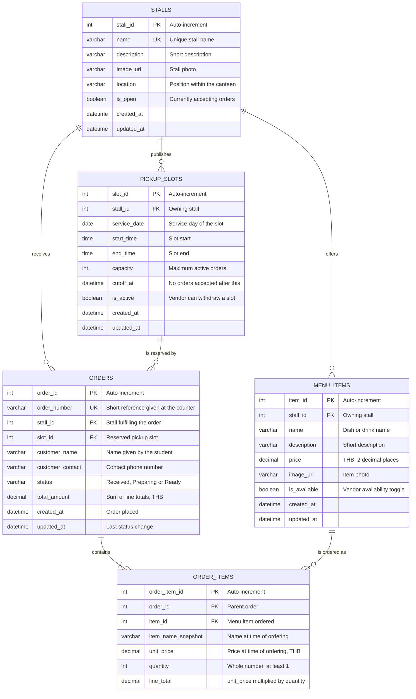

# Database Design — CanteenFlow QuickPick

| Field | Value |
| --- | --- |
| Project | CanteenFlow QuickPick |
| Student | Dilshan Gulati |
| Student ID | 6605142005 |
| Project owner | Dilshan Gulati (sole owner) |
| Work type | Individual assignment |
| Document | Database Design |
| Version | 1.0 |
| Date | 2026-09-05 |
| Target engine | Relational SQL (MySQL 8 or PostgreSQL 14+); types below use MySQL spelling |

**Related documents:** [Documentation index](./README.md) ·
[Design Thinking](./CanteenFlow-QuickPick-Design-Thinking.md) ·
[Project Charter](./Project-Charter-CanteenFlow-QuickPick.md) ·
[Requirements](./Requirements-Specification-CanteenFlow-QuickPick.md) ·
[Acceptance Criteria](./Acceptance-Criteria-CanteenFlow-QuickPick.md)

---

## Contents

- [1. Purpose](#1-purpose)
- [2. Design principles](#2-design-principles)
- [3. Entity overview](#3-entity-overview)
- [4. ER diagram](#4-er-diagram)
- [5. Table specifications](#5-table-specifications)
- [6. Relationships](#6-relationships)
- [7. Capacity enforcement](#7-capacity-enforcement)
- [8. Indexes](#8-indexes)
- [9. Representative queries](#9-representative-queries)
- [10. Data lifecycle and privacy](#10-data-lifecycle-and-privacy)
- [11. Vendor authentication](#11-vendor-authentication)
- [12. Deliberate exclusions](#12-deliberate-exclusions)

---

## 1. Purpose

This document specifies the database supporting the CanteenFlow QuickPick MVP. Five core tables are in
scope — `stalls`, `menu_items`, `pickup_slots`, `orders`, and `order_items` — together with the constraints
that make the project's central rule enforceable in data:

> **A pickup slot can never hold more active orders than its capacity, and a slot past its cut-off time can
> never accept a new order.**

The schema traces directly to the
[Requirements Specification](./Requirements-Specification-CanteenFlow-QuickPick.md) and is verified by the
[Acceptance Criteria](./Acceptance-Criteria-CanteenFlow-QuickPick.md).

## 2. Design principles

| # | Principle | Consequence in the schema |
| --- | --- | --- |
| P-1 | Capacity is data, not a screen rule | `pickup_slots.capacity` and a server-side count of active orders; the interface only reflects it |
| P-2 | One order belongs to one stall and one slot | `orders.stall_id` and `orders.slot_id` are both `NOT NULL` |
| P-3 | An order occupies exactly one place regardless of item count | Capacity counts rows in `orders`, never quantities in `order_items` |
| P-4 | Historical orders must stay readable | `order_items` stores the item name and unit price at the time of ordering |
| P-5 | No account, no payment data | `orders` holds only a customer name and contact number; no payment column exists anywhere |
| P-6 | Statuses are constrained values | `orders.status` is limited to `Received`, `Preparing`, `Ready` |
| P-7 | Nothing is orphaned | Foreign keys with explicit delete behaviour on every relationship |

## 3. Entity overview

| Entity | Represents | Owns | Owned by |
| --- | --- | --- | --- |
| `stalls` | A campus food vendor's stall | `menu_items`, `pickup_slots`, `orders` | — |
| `menu_items` | A dish or drink sold by one stall | referenced by `order_items` | `stalls` |
| `pickup_slots` | A capacity-limited collection interval | referenced by `orders` | `stalls` |
| `orders` | One student's order for one stall and one slot | `order_items` | `stalls`, `pickup_slots` |
| `order_items` | One line of an order | — | `orders`, `menu_items` |

## 4. ER diagram



## 5. Table specifications

### 5.1 `stalls`

Campus food vendors. Supports MVP feature 1 ([FR-01 – FR-03](./Requirements-Specification-CanteenFlow-QuickPick.md#41-stalls-and-menu-mvp-1-2-and-3)).

| Column | Type | Null | Key | Default | Description |
| --- | --- | --- | --- | --- | --- |
| `stall_id` | `INT UNSIGNED AUTO_INCREMENT` | No | PK | — | Surrogate key |
| `name` | `VARCHAR(100)` | No | UQ | — | Stall name shown to students |
| `description` | `VARCHAR(255)` | Yes | — | `NULL` | Short description on the stall card |
| `image_url` | `VARCHAR(500)` | Yes | — | `NULL` | Stall photo; a placeholder is used when null |
| `location` | `VARCHAR(100)` | Yes | — | `NULL` | Position within the canteen, for collection |
| `is_open` | `BOOLEAN` | No | — | `TRUE` | `FALSE` blocks new orders (FR-03) |
| `created_at` | `DATETIME` | No | — | `CURRENT_TIMESTAMP` | Record creation |
| `updated_at` | `DATETIME` | No | — | `CURRENT_TIMESTAMP` on update | Last change |

**Constraints**

- `PRIMARY KEY (stall_id)`
- `UNIQUE KEY uq_stalls_name (name)`

### 5.2 `menu_items`

Dishes and drinks sold by one stall. Supports MVP features 2 and 3
([FR-04 – FR-08](./Requirements-Specification-CanteenFlow-QuickPick.md#41-stalls-and-menu-mvp-1-2-and-3)) and
the vendor availability toggle ([FR-25](./Requirements-Specification-CanteenFlow-QuickPick.md#45-vendor-dashboard-mvp-9)).

| Column | Type | Null | Key | Default | Description |
| --- | --- | --- | --- | --- | --- |
| `item_id` | `INT UNSIGNED AUTO_INCREMENT` | No | PK | — | Surrogate key |
| `stall_id` | `INT UNSIGNED` | No | FK → `stalls.stall_id` | — | Owning stall |
| `name` | `VARCHAR(100)` | No | — | — | Item name |
| `description` | `VARCHAR(255)` | Yes | — | `NULL` | Short description |
| `price` | `DECIMAL(8,2)` | No | — | — | Current price in THB |
| `image_url` | `VARCHAR(500)` | Yes | — | `NULL` | Item photo; a placeholder is used when null (AC-02.4) |
| `is_available` | `BOOLEAN` | No | — | `TRUE` | `FALSE` blocks the item from new orders (FR-06) |
| `created_at` | `DATETIME` | No | — | `CURRENT_TIMESTAMP` | Record creation |
| `updated_at` | `DATETIME` | No | — | `CURRENT_TIMESTAMP` on update | Last change, including availability |

**Constraints**

- `PRIMARY KEY (item_id)`
- `FOREIGN KEY (stall_id) REFERENCES stalls(stall_id) ON DELETE CASCADE`
- `UNIQUE KEY uq_menu_items_stall_name (stall_id, name)`
- `CHECK (price >= 0)`

### 5.3 `pickup_slots`

The capacity-limited collection intervals that carry the project's queue-reduction mechanism. Supports MVP
features 4 and 5 ([FR-09 – FR-12](./Requirements-Specification-CanteenFlow-QuickPick.md#42-pickup-slots-mvp-4-and-5)).

| Column | Type | Null | Key | Default | Description |
| --- | --- | --- | --- | --- | --- |
| `slot_id` | `INT UNSIGNED AUTO_INCREMENT` | No | PK | — | Surrogate key |
| `stall_id` | `INT UNSIGNED` | No | FK → `stalls.stall_id` | — | Stall publishing the slot |
| `service_date` | `DATE` | No | — | — | Service day the slot belongs to |
| `start_time` | `TIME` | No | — | — | Start of the collection interval |
| `end_time` | `TIME` | No | — | — | End of the collection interval |
| `capacity` | `INT UNSIGNED` | No | — | — | Maximum number of active orders (FR-10) |
| `cutoff_at` | `DATETIME` | No | — | — | Ordering closes at this moment (FR-11) |
| `is_active` | `BOOLEAN` | No | — | `TRUE` | `FALSE` withdraws a slot without deleting it |
| `created_at` | `DATETIME` | No | — | `CURRENT_TIMESTAMP` | Record creation |
| `updated_at` | `DATETIME` | No | — | `CURRENT_TIMESTAMP` on update | Last change |

**Constraints**

- `PRIMARY KEY (slot_id)`
- `FOREIGN KEY (stall_id) REFERENCES stalls(stall_id) ON DELETE CASCADE`
- `UNIQUE KEY uq_slots_stall_date_start (stall_id, service_date, start_time)`
- `CHECK (end_time > start_time)`
- `CHECK (capacity > 0)`

**Derived value — not stored**

```text
remaining_capacity = capacity − COUNT(orders WHERE slot_id = this slot AND status IN ('Received','Preparing','Ready'))
```

Remaining capacity is computed rather than stored so it can never drift out of step with the orders that
actually exist.

### 5.4 `orders`

One student's order against one stall and one slot. Supports MVP features 6, 7, and 8
([FR-13 – FR-20](./Requirements-Specification-CanteenFlow-QuickPick.md#43-ordering-mvp-6-and-7)).

| Column | Type | Null | Key | Default | Description |
| --- | --- | --- | --- | --- | --- |
| `order_id` | `INT UNSIGNED AUTO_INCREMENT` | No | PK | — | Surrogate key |
| `order_number` | `VARCHAR(12)` | No | UQ | — | Short reference read aloud at the counter (FR-16, BR-06) |
| `stall_id` | `INT UNSIGNED` | No | FK → `stalls.stall_id` | — | Fulfilling stall |
| `slot_id` | `INT UNSIGNED` | No | FK → `pickup_slots.slot_id` | — | Reserved pickup slot |
| `customer_name` | `VARCHAR(100)` | No | — | — | Name given by the student (FR-13) |
| `customer_contact` | `VARCHAR(20)` | No | — | — | Contact phone number (FR-13, FR-19) |
| `status` | `ENUM('Received','Preparing','Ready')` | No | — | `'Received'` | Current order status (FR-18, BR-05) |
| `total_amount` | `DECIMAL(10,2)` | No | — | — | Sum of `order_items.line_total` |
| `created_at` | `DATETIME` | No | — | `CURRENT_TIMESTAMP` | When the order was placed |
| `updated_at` | `DATETIME` | No | — | `CURRENT_TIMESTAMP` on update | Last status change |

**Constraints**

- `PRIMARY KEY (order_id)`
- `UNIQUE KEY uq_orders_order_number (order_number)`
- `FOREIGN KEY (stall_id) REFERENCES stalls(stall_id) ON DELETE RESTRICT`
- `FOREIGN KEY (slot_id) REFERENCES pickup_slots(slot_id) ON DELETE RESTRICT`
- `CHECK (total_amount >= 0)`

`ON DELETE RESTRICT` prevents a stall or slot with orders against it from being deleted, satisfying
[NFR-08](./Requirements-Specification-CanteenFlow-QuickPick.md#52-reliability-and-data-integrity). Vendors
withdraw a slot with `is_active = FALSE` rather than deleting it.

**Status transitions**

| From | Allowed next | Rule |
| --- | --- | --- |
| `Received` | `Preparing` | FR-24 |
| `Preparing` | `Ready` | FR-24 |
| `Ready` | — | Terminal in the MVP (AC-09.6) |

### 5.5 `order_items`

The lines of an order. Supports MVP feature 3 and the confirmation and dashboard views
([FR-08](./Requirements-Specification-CanteenFlow-QuickPick.md#41-stalls-and-menu-mvp-1-2-and-3),
[FR-17](./Requirements-Specification-CanteenFlow-QuickPick.md#43-ordering-mvp-6-and-7),
[FR-23](./Requirements-Specification-CanteenFlow-QuickPick.md#45-vendor-dashboard-mvp-9)).

| Column | Type | Null | Key | Default | Description |
| --- | --- | --- | --- | --- | --- |
| `order_item_id` | `INT UNSIGNED AUTO_INCREMENT` | No | PK | — | Surrogate key |
| `order_id` | `INT UNSIGNED` | No | FK → `orders.order_id` | — | Parent order |
| `item_id` | `INT UNSIGNED` | No | FK → `menu_items.item_id` | — | Menu item ordered |
| `item_name_snapshot` | `VARCHAR(100)` | No | — | — | Item name as it was when ordered |
| `unit_price` | `DECIMAL(8,2)` | No | — | — | Price as it was when ordered |
| `quantity` | `INT UNSIGNED` | No | — | — | Whole number, at least 1 (FR-07) |
| `line_total` | `DECIMAL(10,2)` | No | — | — | `unit_price × quantity` |

**Constraints**

- `PRIMARY KEY (order_item_id)`
- `FOREIGN KEY (order_id) REFERENCES orders(order_id) ON DELETE CASCADE`
- `FOREIGN KEY (item_id) REFERENCES menu_items(item_id) ON DELETE RESTRICT`
- `UNIQUE KEY uq_order_items_order_item (order_id, item_id)` — one line per item; a repeat increases quantity
- `CHECK (quantity >= 1)`
- `CHECK (unit_price >= 0)`

The name and price snapshots satisfy principle [P-4](#2-design-principles): a later price change or rename
must not alter what a placed order says, which is what AC-09.9 requires.

## 6. Relationships

| Relationship | Cardinality | Delete behaviour | Reason |
| --- | --- | --- | --- |
| `stalls` → `menu_items` | 1 : 0..N | `CASCADE` | A menu has no meaning without its stall |
| `stalls` → `pickup_slots` | 1 : 0..N | `CASCADE` | A slot has no meaning without its stall |
| `stalls` → `orders` | 1 : 0..N | `RESTRICT` | Orders are records of what happened and must survive |
| `pickup_slots` → `orders` | 1 : 0..N | `RESTRICT` | Deleting a slot would destroy the capacity record |
| `orders` → `order_items` | 1 : 1..N | `CASCADE` | Lines belong entirely to their order; an order always has at least one line |
| `menu_items` → `order_items` | 1 : 0..N | `RESTRICT` | Past order lines still reference the item; withdraw it with `is_available = FALSE` |

## 7. Capacity enforcement

This section describes how the project's core rule is guaranteed rather than merely displayed. It backs
[FR-12](./Requirements-Specification-CanteenFlow-QuickPick.md#42-pickup-slots-mvp-4-and-5),
[NFR-06, NFR-07](./Requirements-Specification-CanteenFlow-QuickPick.md#52-reliability-and-data-integrity),
and [AC-05.6](./Acceptance-Criteria-CanteenFlow-QuickPick.md#7-ac-05--prevent-selection-of-full-or-expired-pickup-slots).

### 7.1 Selectability

A slot is selectable only when **all** of the following are true:

```text
pickup_slots.is_active = TRUE
AND stalls.is_open      = TRUE
AND NOW()               < pickup_slots.cutoff_at
AND active_order_count  < pickup_slots.capacity
```

### 7.2 Order creation transaction

Order creation runs as one transaction. If any step fails, nothing is written — no order row, no line rows,
no capacity consumed ([AC-X3](./Acceptance-Criteria-CanteenFlow-QuickPick.md#12-cross-cutting-criteria)).

1. `BEGIN`
2. Lock the slot row: `SELECT ... FROM pickup_slots WHERE slot_id = ? FOR UPDATE`
3. Re-check `is_active`, the owning stall's `is_open`, and `NOW() < cutoff_at` — otherwise roll back with
   "pickup time closed".
4. Count active orders for the slot; if the count is greater than or equal to `capacity`, roll back with
   "slot full".
5. Re-check that every ordered `menu_items.is_available` is still `TRUE` — otherwise roll back naming the item.
6. Insert the `orders` row with a generated unique `order_number` and status `Received`.
7. Insert every `order_items` row, snapshotting the name and unit price.
8. Update `orders.total_amount` from the inserted lines.
9. `COMMIT`

Step 2 is what makes AC-05.6 hold: the row lock serialises two simultaneous submissions for the last place,
so the second one sees the first one's order and is rejected.

### 7.3 Why capacity is not a stored counter

A stored `orders_placed` column could drift away from the real number of orders after a failure or a manual
correction. Counting live rows means remaining capacity is always exactly what the order table says, at the
cost of one indexed count per read — acceptable at campus scale, and supported by
[`idx_orders_slot_status`](#8-indexes).

## 8. Indexes

| Index | Table | Columns | Purpose |
| --- | --- | --- | --- |
| `PRIMARY` | all tables | surrogate key | Row identity |
| `uq_stalls_name` | `stalls` | `name` | Prevents duplicate stall names |
| `idx_menu_items_stall_available` | `menu_items` | `stall_id`, `is_available` | Stall menu listing (FR-04, FR-05) |
| `uq_menu_items_stall_name` | `menu_items` | `stall_id`, `name` | Prevents duplicate item names in one stall |
| `idx_slots_stall_date` | `pickup_slots` | `stall_id`, `service_date`, `start_time` | Slot list for a stall and day (FR-09) |
| `idx_slots_cutoff` | `pickup_slots` | `cutoff_at` | Fast filtering of expired slots (FR-11) |
| `uq_orders_order_number` | `orders` | `order_number` | Guarantees a unique reference (FR-16) |
| `idx_orders_slot_status` | `orders` | `slot_id`, `status` | Remaining-capacity count in section [7](#7-capacity-enforcement) |
| `idx_orders_stall_status` | `orders` | `stall_id`, `status` | Vendor dashboard listing (FR-22, FR-23) |
| `idx_orders_number_contact` | `orders` | `order_number`, `customer_contact` | Order tracking lookup (FR-19, NFR-11) |
| `idx_order_items_order` | `order_items` | `order_id` | Loading the lines of an order |

## 9. Representative queries

### 9.1 Slot list with remaining capacity (FR-09, FR-10, FR-11)

```sql
SELECT  s.slot_id,
        s.start_time,
        s.end_time,
        s.capacity,
        s.capacity - COUNT(o.order_id) AS remaining_capacity,
        CASE
            WHEN NOW() >= s.cutoff_at                      THEN 'Closed'
            WHEN s.capacity - COUNT(o.order_id) <= 0       THEN 'Full'
            ELSE 'Available'
        END AS slot_state
FROM        pickup_slots s
LEFT JOIN   orders o
       ON   o.slot_id = s.slot_id
      AND   o.status IN ('Received', 'Preparing', 'Ready')
WHERE       s.stall_id     = ?
  AND       s.service_date = CURDATE()
  AND       s.is_active    = TRUE
GROUP BY    s.slot_id, s.start_time, s.end_time, s.capacity, s.cutoff_at
ORDER BY    s.start_time;
```

### 9.2 Order tracking by number and contact (FR-19, NFR-11)

```sql
SELECT  o.order_number,
        o.status,
        st.name        AS stall_name,
        ps.start_time,
        ps.end_time
FROM    orders o
JOIN    stalls        st ON st.stall_id = o.stall_id
JOIN    pickup_slots  ps ON ps.slot_id  = o.slot_id
WHERE   o.order_number     = ?
  AND   o.customer_contact = ?;
```

### 9.3 Vendor dashboard, orders grouped by slot (FR-22, FR-23)

```sql
SELECT  ps.start_time,
        ps.end_time,
        o.order_number,
        o.customer_name,
        o.status,
        oi.item_name_snapshot,
        oi.quantity
FROM    orders o
JOIN    pickup_slots ps ON ps.slot_id  = o.slot_id
JOIN    order_items  oi ON oi.order_id = o.order_id
WHERE   o.stall_id = ?
  AND   ps.service_date = CURDATE()
ORDER BY ps.start_time, o.created_at, oi.order_item_id;
```

## 10. Data lifecycle and privacy

| Aspect | Rule |
| --- | --- |
| Personal data stored | Only `orders.customer_name` and `orders.customer_contact` |
| Payment data | None; no column in any table can hold payment details ([NFR-10](./Requirements-Specification-CanteenFlow-QuickPick.md#53-security-and-privacy)) |
| Access to contact numbers | Only through a vendor dashboard query scoped to that vendor's own stall ([NFR-09](./Requirements-Specification-CanteenFlow-QuickPick.md#53-security-and-privacy)) |
| Tracking lookup | Requires both `order_number` and `customer_contact`, so a guessed order number alone reveals nothing |
| Retention | Orders older than the current academic term are archived; the two personal columns are cleared on archive while the order and its lines are kept for records |
| Seed data | Sample stalls, items, and slots used for development are clearly fictional and contain no real personal data |

## 11. Vendor authentication

Vendor credentials are deliberately **not** held in the five core tables. Sign-in
([FR-21](./Requirements-Specification-CanteenFlow-QuickPick.md#45-vendor-dashboard-mvp-9)) is handled by the
application's authentication layer, and a vendor account is associated with exactly one `stalls.stall_id`.
Every dashboard query is then filtered by that stall id, which is what
[AC-09.2](./Acceptance-Criteria-CanteenFlow-QuickPick.md#11-ac-09--vendor-dashboard-for-orders-and-menu-availability)
verifies. No password or secret is stored in the tables described here, and none is committed to this
repository ([NFR-13](./Requirements-Specification-CanteenFlow-QuickPick.md#53-security-and-privacy)).

## 12. Deliberate exclusions

The following have no table, column, or relationship in this design, matching
[Project Charter section 4.2](./Project-Charter-CanteenFlow-QuickPick.md#42-out-of-scope):

| Excluded | Would have required |
| --- | --- |
| Online payments | Payment, transaction, and refund tables |
| Delivery | Address, courier, and route tables |
| Loyalty points | Points ledger and reward tables |
| AI recommendations | Behavioural event and model-feature tables |
| Multi-campus support | A campus table and a campus key on `stalls` |
| Student accounts | A users table with credentials and order history |
| Order cancellation | A `Cancelled` status and a rule returning the place to capacity |

Each would be added in a later version if the scope changes through
[charter change control](./Project-Charter-CanteenFlow-QuickPick.md#43-scope-change-control).
